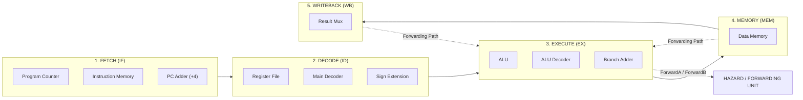

# 32-Bit 5-Stage Pipelined RISC-V (RV32I) Processor Core

## Overview
This repository contains a functional 32-bit 5-stage pipelined processor core implementing a subset of the **RISC-V (RV32I)** Instruction Set Architecture (ISA). Designed and verified in Verilog HDL using AMD Xilinx Vivado, the processor features full data hazard handling via forwarding mechanisms and control logic.

---

## Datapath Architecture

The processor follows the classic 5-stage RISC-V pipelined architecture:

### Pipeline Stages Breakdown

1. **Instruction Fetch (IF):**
   * **Program Counter (`pc.v`):** Maintains the current instruction address on `posedge clk`.
   * **Instruction Memory (`instruction_mem.v`):** Asynchronously fetches 32-bit RISC-V instructions from `memfile.hex` mapped to word addresses (`A[6:2]`).
   * **PC Adder (`PC_Adder.v`):** Computes sequential next-instruction addresses (`PC + 4`).

2. **Instruction Decode (ID):**
   * **Register File (`register_file.v`):** Dual-read, single-write 32x32-bit register array with asynchronous read and synchronous write capabilities. Register `x0` is hardwired to `32'b0`.
   * **Main Decoder (`main_decoder.v`) & ALU Decoder (`ALU_decoder.v`):** Decodes 7-bit opcodes (`InstrD[6:0]`), `funct3`, and `funct7` to generate control signals (`RegWrite`, `ALUSrc`, `MemWrite`, `ResultSrc`, `Branch`, `ALUControl`).
   * **Sign Extension (`immediate_gen.v`):** Generates sign-extended 32-bit immediates for I-type and S-type instructions.

3. **Execute (EX):**
   * **Arithmetic Logic Unit (`alu.v`):** Performs arithmetic and bitwise operations (ADD, SUB, AND, OR, XOR, SLT, SLL, SRL).
   * **Forwarding Muxes (`Mux.v`):** Selects between register outputs, EX/MEM forwarded results, or MEM/WB forwarded results to resolve data hazards dynamically.
   * **Branch Adder (`PC_Adder.v`):** Calculates branch target addresses (`PCE + Imm_Ext_E`).

4. **Memory Access (MEM):**
   * **Data Memory (`data_mem.v`):** Handles synchronous memory writes (`MemWrite`) and asynchronous reads for load instructions (`lw`, `sw`).

5. **Writeback (WB):**
   * **Result Mux (`writeback_cycle.v`):** Selects between ALU execution results and Data Memory outputs to write back into the Register File.

---

## Hazard Handling & Forwarding Logic

The **Hazard Unit (`hazard_unit.v`)** actively monitors register destinations (`RD_M`, `RD_W`) against source registers (`Rs1_E`, `Rs2_E`) to eliminate EX-to-EX and MEM-to-EX execution stalls without sacrificing performance:

* **Forwarding Condition 1 (EX-to-EX):** Forwarded from Memory Stage (`ALU_ResultM`) when `RegWriteM` is active and source register matches `RD_M`.
* **Forwarding Condition 2 (MEM-to-EX):** Forwarded from Writeback Stage (`ResultW`) when `RegWriteW` is active and source register matches `RD_W`.

---

## Supported Instruction Set Subset

* **R-Type:** `add`, `sub`, `and`, `or`, `xor`, `slt`, `sll`, `srl`
* **I-Type:** `addi`, `lw`
* **S-Type:** `sw`
* **B-Type:** `beq`

---

## Repository Structure
graph TD
    %% Top Level
    subgraph TOP[" Top-Level & Testbench"]
        direction TB
        pipeline_top["pipeline_top.v # Processor top-level wrapper module"]
        pipeline_tb["pipeline_2_tb.v # Simulation Testbench"]
    end

    %% Pipeline Stages
    subgraph IF["1. FETCH (IF)"]
        direction TB
        pc["pc.v # Program Counter register module"]
        PC_Adder["PC_Adder.v # 32-bit Adder module"]
        instruction_mem["instruction_mem.v # Instruction ROM memory module"]
    end

    subgraph ID["2. DECODE (ID)"]
        direction TB
        register_file["register_file.v # 32 x 32-bit Register File"]
        main_decoder["main_decoder.v # Decodes 7-bit opcode to control signals"]
        control_unit_top["control_unit_top.v # Top control unit wrapping Main & ALU decoders"]
        immediate_gen["immediate_gen.v # Immediate Sign Extension generator"]
    end

    subgraph EX["3. EXECUTE (EX)"]
        direction TB
        alu["alu.v # Arithmetic Logic Unit"]
        ALU_decoder["ALU_decoder.v # Decodes funct3/funct7 into 3-bit ALU controls"]
        Mux["Mux.v # 2-to-1 and 3-to-1 Multiplexers"]
    end

    subgraph MEM["4. MEMORY (MEM)"]
        direction TB
        data_mem["data_mem.v # Data Memory module"]
    end

    subgraph WB["5. WRITEBACK (WB)"]
        direction TB
        writeback_cycle["writeback_cycle.v # Writeback stage logic"]
    end

    %% Pipeline Registers
    subgraph REGS[" Pipeline Registers"]
        if_id["if_id.v # IF/ID pipeline register"]
        id_ex["id_ex.v # ID/EX pipeline register"]
        ex_dm["ex_dm.v # EX/MEM pipeline register"]
        dm_wb["dm_wb.v # MEM/WB pipeline register"]
    end

    %% Hazard Control
    subgraph HAZARD[" Hazard Control"]
        hazard_unit["hazard_unit.v # Data hazard detection & forwarding unit"]
    end

    %% Documentation & Assets
    subgraph DOCS[" Project Files"]
        memfile["memfile.hex # RISC-V machine code hex file"]
        readme["README.md # Project documentation"]
    end

    %% Pipeline Flow Connections
    IF --> if_id --> ID --> id_ex --> EX --> ex_dm --> MEM --> dm_wb --> WB
    
    %% Hazard Connections
    hazard_unit -. Control Signals .-> REGS
    hazard_unit -. Forwarding .-> EX
